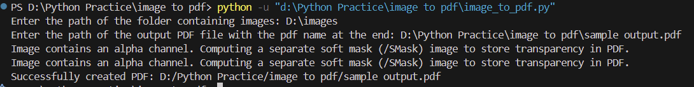

# Image to pdf

## Introduction

This project provides a simple and efficient way to convert images to PDF format using Python. It is designed to handle multiple image formats and combine them into a single PDF file.

## Description

The script leverages popular Python libraries to read image files, process them, and generate a PDF document. It supports batch processing, allowing users to convert multiple images at once. This tool is ideal for creating photo albums, document digitization, and more.

## Tech Stack

- Python

## Contains

- Code in vanilla python (.py extension)
- Code in jupyter notebook python (.ipynb extension)
- sample output pdf generated using vanilla
- sample output pdf generated using ipynb

## Installation

1. git clone https://github.com/kareem1207/img2pdf.git
2. cd img2pdf-main

## Requirements

- img2pdf module

## Outputs

- output 1 :
  

- output 2 :
  

> [!Caution]
> when entering addresses please mention it in single slash format not double
